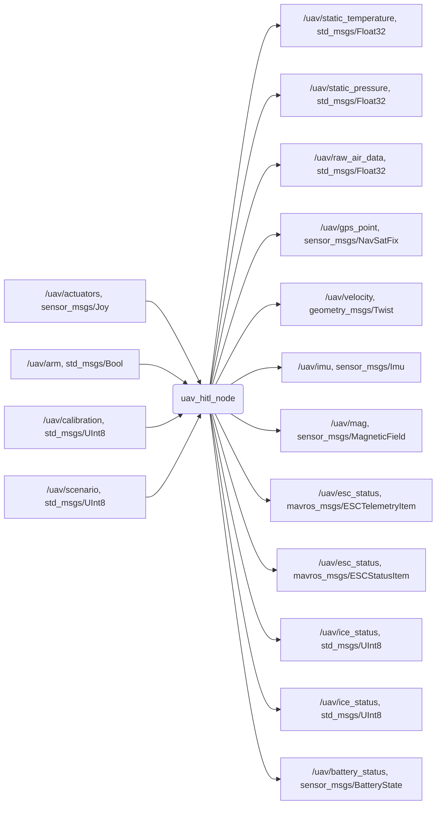
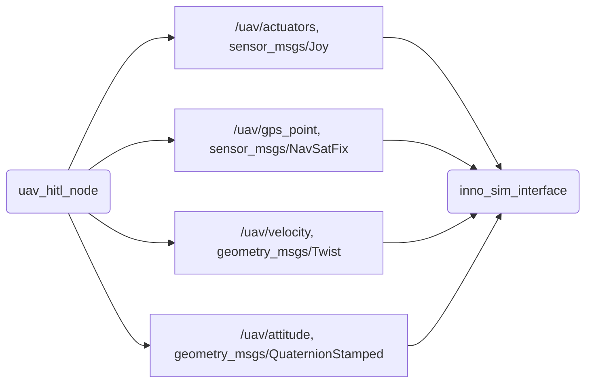

# inno_vtol_dynamics    

This package is the core of the [UAV HITL dynamics simulator](https://github.com/InnopolisAero/innopolis_vtol_dynamics). It has an implementation of custom quadcopter vertical takeoff and landing aircraft dynamics.

Innopolis VTOL has UAVCAN onboard electronics based on [RaccoonLab Cyphal/DroneCAN sensors and actuators](https://raccoonlab.co/store) (so it's a good example of full UAVCAN-based onboard control and object for new UAVCAN-HITL simulation approach).

This package contains Innopolis VTOL simulation based on rigid body kinematics and dynamics, CFD analysis and actuators simulation.

The package is used inside a new Cyphal/DroneCAN-HITL . 

The node from this package communicates with the flight stack via communicator `UAV dynamics` by subscribing and publishing to the following topics:

Auxilliary topics might be enabled/disabled in the [sim_params.yaml](uav_dynamics/inno_vtol_dynamics/config/sim_params.yaml) config file. You may implement your own sensors in the [sensors.cpp](uav_dynamics/inno_vtol_dynamics/src/sensors/sensors.cpp) file.

To work in pair with [InnoSimulator](https://github.com/inno-robolab/InnoSimulator) as physics engine via [inno_sim_interface](https://github.com/RaccoonlabDev/inno_sim_interface) it publishes and subscribes on following topics.

