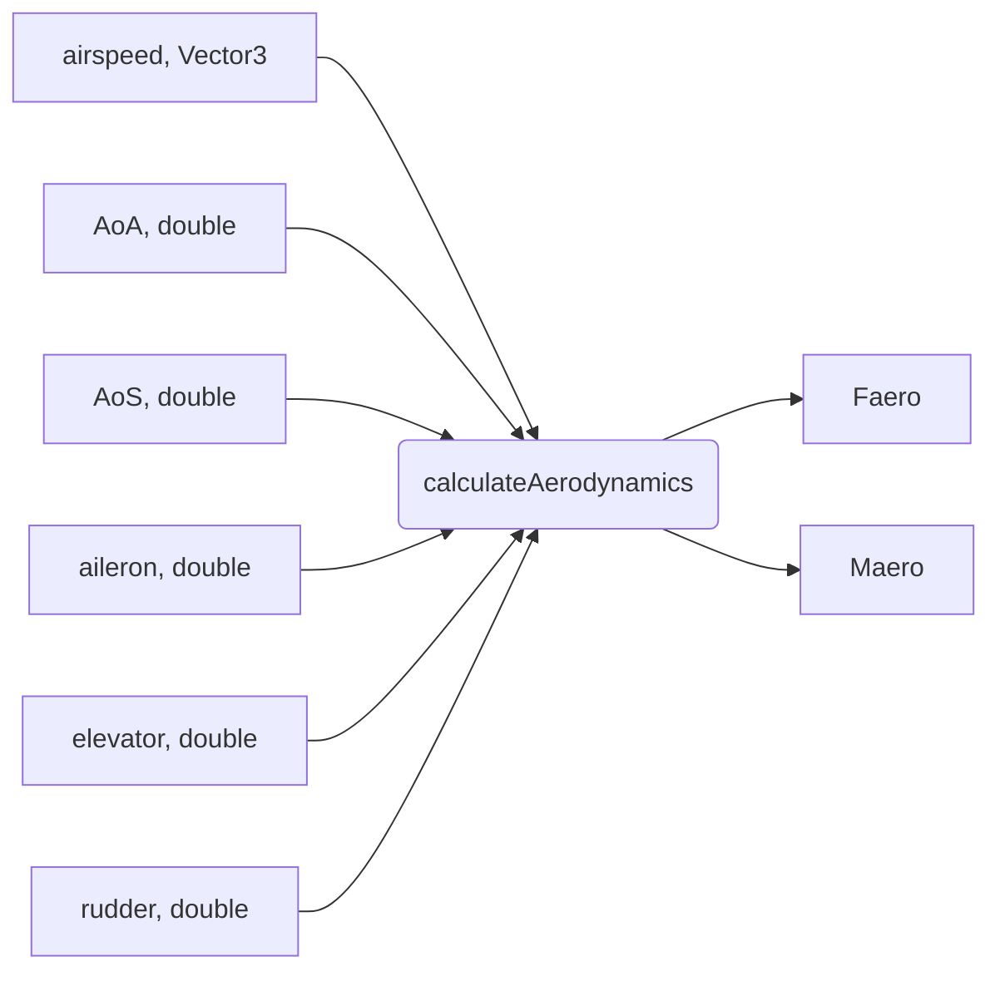

# Introduction

In our model, aerodynamic forces and moments depend on airspeed, angle of attack and control surface positions. The characteristic wing length and air density are constant. The dynamic pressure depends only on the airspeed module. The simulated airspeed, angle of attack and sideslip are limited and are described in a table in the model specification. It is assumed that the control surfaces are only generating moments.

For CFD, our assumptions are
- The VTOL 3D model is located in the centre of the computational domain (0,0,0);
- all the flight control surfaces, such as the rudder, the elevator and the ailerons, have been formed as separate elements so that they can be rotated independently and the corresponding characteristic curve can be studied.

As a result of the CFD research, we need data sets that describe the main aerodynamic characteristics of the VTOL as a function of angle of attack and sideslip, as well as the deviations of the control surfaces in the considered speed range.

The aerodynamic force is the sum of the lift, drag and sideslip forces. These forces can be calculated using the following equations:

$$
F_{lift} = \dfrac{1}{2} * q * C_{L_{\alpha}}\\
F_{drag} = \dfrac{1}{2} * q * C_{D_{\alpha}}\\
F_{sideslip} = \dfrac{1}{2} * q * (C_{S_{\alpha}} + C_{S_{\beta}} + C_{S_r})\\
$$

where 
- $q$ is the dynamics pressure, $q = \rho * V^2 * S$, $\rho$ is atmoshpere pressure, $V$ is airspeed, $S$ is wing area;
- $C_{L_{\alpha}}$ is the coefficient of lift force that depends on airspeed and angle of attack, 
- $C_{D_{\alpha}}$ is the coefficient of drag force that depends on airspeed and angle of attack, 
- $C_{S_{\alpha}}$ and $C_{S_{\beta}}$ are coefficients of sideslip force which depends on airspeed, angle of attack and angle of sideslip,
- $C_{S_r}$ is the coefficient of sideslip force which depends on airspeed, rudder angle.

Aerodynamics moment is divided into 2 terms: first term depends on airspeed and angle of attack, second term depends on airspeed and control surface positions.

$$
M_{x} = \dfrac{1}{2} * q * l * (C_{mx} + C_{mxa} * {\delta}_{a})\\
M_{y} = \dfrac{1}{2} * q * l * (C_{my} + C_{mye} * {\delta}_{e})\\
M_{z} = \dfrac{1}{2} * q * l * (C_{mz} + C_{mzr} * {\delta}_{r})\\
$$

where 
- $l$ is the characteristic length, 
- $C_{mx}$, $C_{my}$, $C_{mz}$ are coefficients which define the first mention term, 
- $C_{mxa}$, $C_{mye}$, $C_{mzr}$ are coefficients which describe the second, 
- ${\delta}_{a}$, ${\delta}_{e}$, ${\delta}_{r}$ are aileron, elevator and rudder positions respectively.

# Aerodynamics Coefficients List

So, here is a list of all aerodynamics coefficients:

- $C_{L_{\alpha}}$, $C_{D_{\alpha}}$, $C_{S_{\alpha}}$ are functions of airspeed and AoA, 

- $C_{S_{\beta}}$ is a function of airspeed and AoS,
- $C_{S_r}$ is a function of airspeed and rudder angle,

- $C_{mx}$, $C_{my}$, $C_{mz}$ are functions of airspeed and AoA, 

- $C_{mxa}$ is a function of airspeed and aileron angle, 
- $C_{mye}$ is a function of airspeed and elevator angle, 
- $C_{mzr}$ is a function of airspeed and rudder angle.


# Aerodynamics Configuration File

File [aerodynamics_coeffs.yaml](../config/aerodynamics_coeffs.yaml) is an example of aerodynamics data used by Innopolis VTOL model.

We use CFD to find the values of above coefficients for several airspeeds and AoS, AoA (for each values in `airspeed_table` and `AoS`, `AoA` tables).

```yaml
airspeed_table: [5, 10, 15, 20, 25, 30, 35, 40]

AoS: [-90, -88, -86, -84, -82, -80, -78, -76, -74, -72, -70, -68, -66, -64, -62, -60, -58, -56, -54, -52, -50, -48, -46, -44, -42, -40, -38, -36, -34, -32, -30, -28, -26, -24, -22, -20, -18, -16, -14, -12, -10, -8, -6, -4, -2, 2, 4, 6, 8, 10, 12, 14, 16, 18, 20, 22, 24, 26, 28, 30, 32, 34, 36, 38, 40, 42, 44, 46, 48, 50, 52, 54, 56, 58, 60, 62, 64, 66, 68, 70, 72, 74, 76, 78, 80, 82, 84, 86, 88, 90]

AoA: [-45, -44, -42, -40, -38, -36, -34, -32, -30, -28, -26, -24, -22, -20, -18, -16, -14, -12, -10, -8, -6, -4, -2, 0, 2, 4, 6, 8, 10, 12, 14, 16, 18, 20, 22, 24, 26, 28, 30, 32, 34, 36, 38, 40, 42, 44, 45]
```

## Data formats of the tables

There are two types of tables defined in aerodynamics_coeffs.yaml for use in calculateAerodynamics:
- grid data;
- polynomial coefficients grid data.

### Grid Data

Grid data format is used for the $C_{S_{\beta}}$, $C_{S_r}$, $C_{mxa}$, $C_{mye}$, $C_{mzr}$ (`CS_rudder_table`, `CS_beta`, `CmxAileron`, `CmyElevator`, `CmzRudder`).

Grid data is a simple 2-dimensional table (grid).
The row corresponds to the airspeed (listed in the `airspeed_table`). 
The collumn corresponds to the angle: 
- AoS ($\beta$) for $C_{S_{\beta}}$ (`CS_beta`), 
- rudder for $C_{S_r}$  (`CS_rudder_table`), 
- aileron angle for $C_{mxa}$ (`CmxAileron`), 
- elevator angle for $C_{mye}$ (`CmyElevator`), 
- rudder angle for $C_{mzr}$ (`CmzRudder`).

### Polynomial Coefficients Grid Data

For the main aerodynamic coefficients we calculate the polynomial approximations (7-degrees) of how the aerodynamic coefficients depend on the AoA or AoS at each airspeed.
We do this for $C_{L_{\alpha}}$, $C_{D_{\alpha}}$, $C_{S_{\alpha}}$, $C_{mx}$, $C_{my}$, $C_{mz}$ 
(`CLPolynomial`, `CDPolynomial`, `CSPolynomial`, `CmxPolynomial`, `CmyPolynomial`, `CmzPolynomial`).

The row corresponds to the airspeed (listed in the `airspeed_table`). The first column contains the airspeed values. The other columns contain the polynomial coefficients. The polynomial coefficients define the approximation of how aerodynamic coefficient depends on AoA: 
$$f(x) = p_0*x^n + p_1*x^{n-1} + ... + p_n$$


# The calculateAerodynamics function

The calculateAerodynamics function takes airspeed vector, values of angles of attack and sideslip (AoA, AoS), aerodynamic surfaces positions (aileron_pos, elevator_pos, rudder_pos) and caluculates aerodynamics forces and moments vectors (Faero, Maero).

